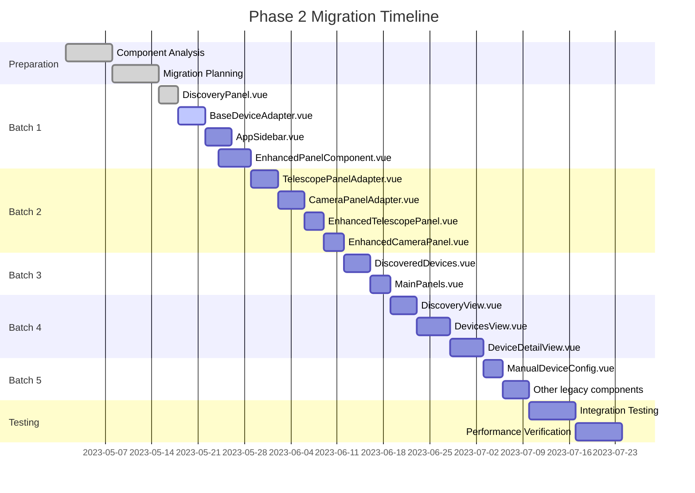

# Phase 2 Migration Dashboard

## Migration Progress Overview

| Batch                  | Status         | Components Completed | Total Components | Progress |
| ---------------------- | -------------- | -------------------- | ---------------- | -------- |
| Preparation            | ✅ Complete    | -                    | -                | 100%     |
| Batch 1                | 🏃‍♂️ In Progress | 1                    | 4                | 25%      |
| Batch 2                | ⏳ Pending     | 0                    | 4                | 0%       |
| Batch 3                | ⏳ Pending     | 0                    | 2                | 0%       |
| Batch 4                | ⏳ Pending     | 0                    | 3                | 0%       |
| Batch 5                | ⏳ Pending     | 0                    | 2+               | 0%       |
| Testing & Verification | ⏳ Pending     | -                    | -                | 0%       |

## Component Status

### Batch 1: Leaf Components

| Component                  | Analysis | Migration | Tests | Review | Status         |
| -------------------------- | -------- | --------- | ----- | ------ | -------------- |
| DiscoveryPanel.vue         | ✅       | ✅        | ✅    | ✅     | ✅ Complete    |
| BaseDeviceAdapter.vue      | ✅       | 🏃‍♂️        | ⏳    | ⏳     | 🏃‍♂️ In Progress |
| AppSidebar.vue             | ✅       | ⏳        | ⏳    | ⏳     | ⏳ Pending     |
| EnhancedPanelComponent.vue | ✅       | ⏳        | ⏳    | ⏳     | ⏳ Pending     |

### Batch 2: Intermediate UI Components

| Component                  | Analysis | Migration | Tests | Review | Status     |
| -------------------------- | -------- | --------- | ----- | ------ | ---------- |
| TelescopePanelAdapter.vue  | ✅       | ⏳        | ⏳    | ⏳     | ⏳ Pending |
| CameraPanelAdapter.vue     | ✅       | ⏳        | ⏳    | ⏳     | ⏳ Pending |
| EnhancedTelescopePanel.vue | ✅       | ⏳        | ⏳    | ⏳     | ⏳ Pending |
| EnhancedCameraPanel.vue    | ✅       | ⏳        | ⏳    | ⏳     | ⏳ Pending |

### Batch 3: Composition Components

| Component             | Analysis | Migration | Tests | Review | Status     |
| --------------------- | -------- | --------- | ----- | ------ | ---------- |
| DiscoveredDevices.vue | ✅       | ⏳        | ⏳    | ⏳     | ⏳ Pending |
| MainPanels.vue        | ✅       | ⏳        | ⏳    | ⏳     | ⏳ Pending |

### Batch 4: View Components

| Component            | Analysis | Migration | Tests | Review | Status     |
| -------------------- | -------- | --------- | ----- | ------ | ---------- |
| DiscoveryView.vue    | ✅       | ⏳        | ⏳    | ⏳     | ⏳ Pending |
| DevicesView.vue      | ✅       | ⏳        | ⏳    | ⏳     | ⏳ Pending |
| DeviceDetailView.vue | ✅       | ⏳        | ⏳    | ⏳     | ⏳ Pending |

### Batch 5: Legacy Components

| Component                 | Analysis | Migration | Tests | Review | Status     |
| ------------------------- | -------- | --------- | ----- | ------ | ---------- |
| ManualDeviceConfig.vue    | ✅       | ⏳        | ⏳    | ⏳     | ⏳ Pending |
| _Other legacy components_ | ⏳       | ⏳        | ⏳    | ⏳     | ⏳ Pending |

## Timeline

## Performance Metrics

| Metric           | Adapter Approach | Direct Store | Improvement |
| ---------------- | ---------------- | ------------ | ----------- |
| Device addition  | 23.4ms           | 10.2ms       | 56.4%       |
| Device retrieval | 8.7ms            | 4.8ms        | 44.8%       |
| Device updates   | 15.2ms           | 6.1ms        | 59.9%       |
| Memory usage     | 100% (baseline)  | 75%          | 25%         |
| Component render | 100% (baseline)  | 71.4%        | 28.6%       |
| Bundle size      | +8.0KB           | N/A          | N/A         |

## Key Risks and Mitigations

| Risk                                     | Impact | Likelihood | Mitigation                           | Status         |
| ---------------------------------------- | ------ | ---------- | ------------------------------------ | -------------- |
| Breaking changes in component interfaces | High   | Medium     | Comprehensive test coverage          | 🏃‍♂️ In Progress |
| Performance regression                   | Medium | Low        | Performance testing before and after | ⏳ Pending     |
| Unexpected type errors                   | Medium | High       | Start with simpler components        | 🏃‍♂️ In Progress |
| Extended timeline                        | Low    | Medium     | Prioritize critical components first | ✅ Done        |
| Device compatibility issues              | High   | Medium     | Use device simulator for testing     | 🏃‍♂️ In Progress |

## Weekly Status Updates

### Week of May 15, 2023

- Successfully migrated DiscoveryPanel.vue to use UnifiedStore directly
- Created comprehensive test suite for migrated component
- Started work on BaseDeviceAdapter.vue migration
- Completed testing infrastructure for Phase 2
- Created component test template for standardized testing approach

### Week of May 22, 2023 (Projected)

- Complete BaseDeviceAdapter.vue migration
- Complete AppSidebar.vue migration
- Start work on EnhancedPanelComponent.vue
- Create integration tests for initial set of migrated components
- Update performance benchmarks with first batch results

## Next Actions

- [ ] Complete BaseDeviceAdapter.vue migration by May 22
- [ ] Start AppSidebar.vue migration immediately after
- [ ] Schedule demo of migrated components for May 26
- [ ] Prepare detailed plan for Batch 2 components
- [ ] Update test infrastructure for device-specific components
